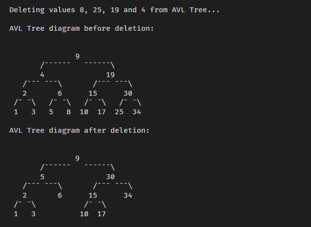

# Usage example

This example script first inserts values into both tree (BST and AVL)

Then it prints the diagrams of both trees with the inserted values

Now it displays the values in-order, pre-order and post-order for both trees

After that, it deletes values from the BST and shows a before and after

And finally, it deletes values from the AVL tree and shows a before and after

All the diagrams are generated from the print_tree_diagram function contained in both trees classes
