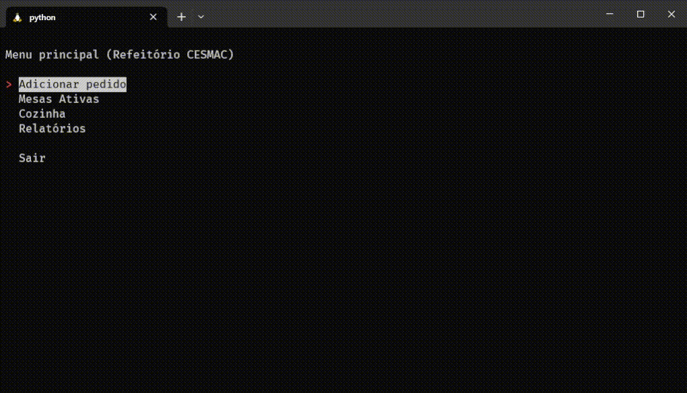

# Data structures assignment (list, queue, stack)

## Goals:

- Step 1: Choose a data structure and justify why it is the most suitable for solving the problem you chose;
- Step 2: Implement the chosen data structure, that is, create a new class with the methods according to the chosen structure. It can be in any programming language;
- Step 3: Use the integrated data structure to solve a problem;

 

My idea was to create a system that uses the 3 data structures of this assignment (list, queue and stack). So I came up with a very simple system for a restaurant. Where orders are placed on a list and then passed to the kitchen in the form of a queue. When the meal is finished and payment is made, it is stored in a stack structure.

Here's a demo:

