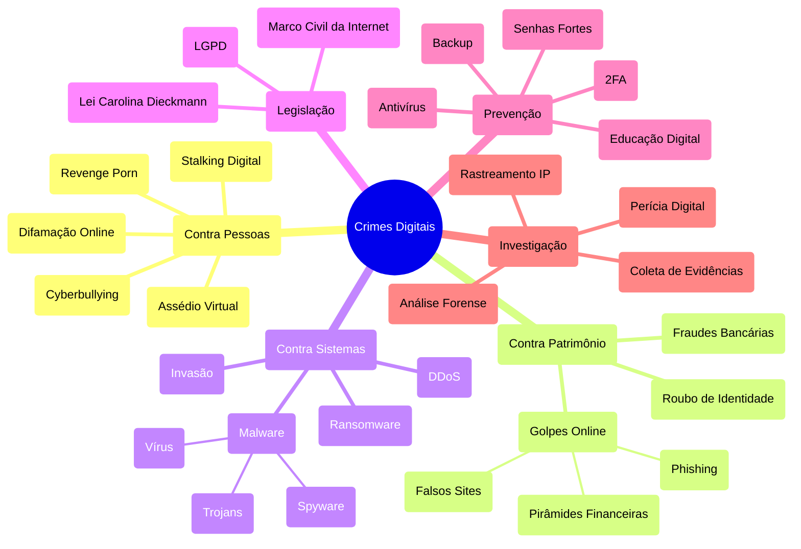

# Direito e Ética na Computação (EA3)

## 📝 Descrição da 3ª EA

Utilizando a Ferramenta de Mapa Mental, construa um Mapa da ultima EA "Crimes digitais" complemente seu estudo com a pesquisa de modelos usados pelos bandidos e desenvolva uma estratégia de proteção. Isto é, pense como analista de segurança que precisa protejer sua empresa ou sua casa.

## 🧠 Mapa mental dos crimes digitais

## 🛡️ Estratégia de proteção

Eu observo que os criminosos digitais têm seguido padrões cada vez mais sofisticados, mas ainda assim previsíveis. A primeira linha de defesa deve sempre ser a proteção contra engenharia social, já que aproximadamente 90% dos ataques bem-sucedidos começam com um erro humano. Isso significa implementar treinamentos regulares para todos os usuários, sejam funcionários ou familiares, sobre como identificar tentativas de phishing, falsas ofertas e manipulações psicológicas.

Na infraestrutura técnica, é fundamental manter uma estratégia de múltiplas camadas. Começamos com a implementação de autenticação de dois fatores (2FA) em todas as contas, especialmente e-mails e acessos bancários. Senhas devem seguir um padrão rigoroso de complexidade e, preferencialmente, serem gerenciadas por um gerenciador de senhas confiável. Para empresas, recomendo o uso de uma VPN corporativa para todos os acessos remotos.

O backup é absolutamente crítico e deve seguir a regra 3-2-1: três cópias dos dados importantes, em dois tipos diferentes de mídia, com uma cópia mantida off-site. Isso nos protege especialmente contra ransomware, que tem sido uma das principais ameaças nos últimos anos. Os backups devem ser testados regularmente para garantir sua efetividade.

Para proteção contra malware, além do antivírus tradicional, recomendo a implementação de um sistema EDR (Endpoint Detection and Response) que pode identificar comportamentos suspeitos mesmo quando não há uma assinatura de vírus conhecida. Também é essencial manter todos os sistemas e softwares atualizados, aplicando patches de segurança assim que disponíveis.

No ambiente doméstico ou de pequenas empresas, o roteador é um ponto crítico frequentemente negligenciado. É necessário trocar as senhas padrão, manter o firmware atualizado e configurar corretamente as regras de firewall. Para IoT (Internet das Coisas), mantenha estes dispositivos em uma rede segregada dos equipamentos principais.

Monitoramento é chave: Sugiro que implemente sistemas de logs centralizados e monitore ativamente por comportamentos anormais. Em casa, verifique regularmente extratos bancários e ative notificações para todas as transações. Para empresas, considere a contratação de um serviço de SOC (Security Operations Center) terceirizado se não houver recursos para manter uma equipe interna.

Por fim, mantenha um plano de resposta a incidentes atualizado e testado. Todos devem saber exatamente o que fazer caso identifiquem um possível ataque, incluindo quem contactar e quais medidas imediatas tomar. No caso de empresas, mantenha contatos previamente estabelecidos com autoridades policiais e empresas de perícia digital.

A segurança digital é um processo contínuo, não um produto ou estado final. As ameaças evoluem constantemente, então nossas defesas precisam ser regularmente revisadas e atualizadas. O investimento em segurança deve ser visto como um seguro: espera-se nunca precisar usar, mas quando necessário, faz toda a diferença.
