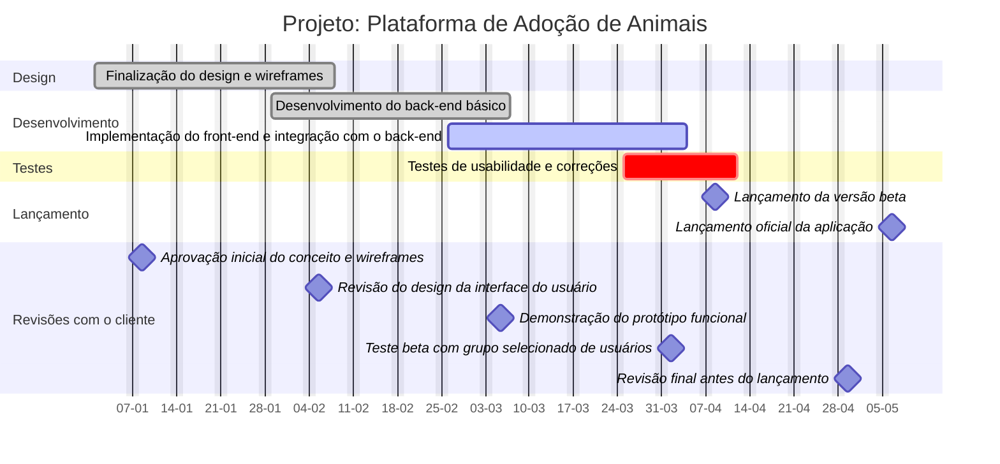

**Passo 1**

**Objetivos:**

1. Criar uma plataforma online que conecta animais de estimação disponíveis para adoção com potenciais adotantes.
2. Facilitar o processo de adoção, tornando-o mais eficiente e acessível.
3. Aumentar o número de adoções bem-sucedidas.
4. Promover a conscientização sobre a importância da adoção responsável.

**Entregas:**

1. Uma aplicação web responsiva e fácil de usar.
2. Sistema de cadastro e autenticação para usuários e abrigos.
3. Banco de dados de animais disponíveis para adoção.
4. Mecanismo de busca e filtragem de animais.
5. Sistema de agendamento de visitas aos abrigos.
6. Formulário de aplicação para adoção online.
7. Painel administrativo para abrigos gerenciarem seus animais.
8. Sistema de mensagens entre adotantes e abrigos.
9. Seção educativa sobre cuidados com animais e adoção responsável.

**Marcos:**

1. Finalização do design e wireframes da aplicação - Semana 4
2. Desenvolvimento do back-end básico - Semana 8
3. Implementação do front-end e integração com o back-end - Semana 12
4. Testes de usabilidade e correções - Semana 14
5. Lançamento da versão beta - Semana 16
6. Lançamento oficial da aplicação - Semana 20

**Requisitos:**

1. A aplicação deve ser compatível com os principais navegadores web.
2. Tempo de carregamento da página inicial não deve exceder 3 segundos.
3. O sistema deve suportar pelo menos 10.000 usuários simultâneos.
4. Conformidade com as leis de proteção de dados vigentes.
5. Interface intuitiva e acessível para usuários de todas as idades.
6. Integração com redes sociais para compartilhamento de perfis de animais.
7. Sistema de notificações por e-mail e push.

**Não escopo:**

1. Desenvolvimento de aplicativos móveis nativos (iOS/Android).
2. Serviços veterinários online.
3. Sistema de doações monetárias para abrigos.
4. Funcionalidade de comércio eletrônico para produtos pet.
5. Serviço de transporte de animais.

**Revisões com o cliente:**

1. Aprovação inicial do conceito e wireframes - Semana 2
2. Revisão do design da interface do usuário - Semana 5
3. Demonstração do protótipo funcional - Semana 10
4. Teste beta com grupo selecionado de usuários - Semana 15
5. Revisão final antes do lançamento - Semana 19

