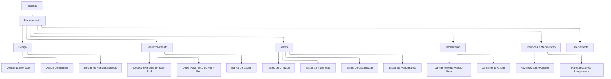

**Passo 1**

**Objetivos:**

1. Criar uma plataforma online que conecta animais de estimação disponíveis para adoção com potenciais adotantes.
2. Facilitar o processo de adoção, tornando-o mais eficiente e acessível.
3. Aumentar o número de adoções bem-sucedidas.
4. Promover a conscientização sobre a importância da adoção responsável.

**Entregas:**

1. Uma aplicação web responsiva e fácil de usar.
2. Sistema de cadastro e autenticação para usuários e abrigos.
3. Banco de dados de animais disponíveis para adoção.
4. Mecanismo de busca e filtragem de animais.
5. Sistema de agendamento de visitas aos abrigos.
6. Formulário de aplicação para adoção online.
7. Painel administrativo para abrigos gerenciarem seus animais.
8. Sistema de mensagens entre adotantes e abrigos.
9. Seção educativa sobre cuidados com animais e adoção responsável.

**Marcos:**

1. Finalização do design e wireframes da aplicação - Semana 4
2. Desenvolvimento do back-end básico - Semana 8
3. Implementação do front-end e integração com o back-end - Semana 12
4. Testes de usabilidade e correções - Semana 14
5. Lançamento da versão beta - Semana 16
6. Lançamento oficial da aplicação - Semana 20

**Requisitos:**

1. A aplicação deve ser compatível com os principais navegadores web.
2. Tempo de carregamento da página inicial não deve exceder 3 segundos.
3. O sistema deve suportar pelo menos 10.000 usuários simultâneos.
4. Conformidade com as leis de proteção de dados vigentes.
5. Interface intuitiva e acessível para usuários de todas as idades.
6. Integração com redes sociais para compartilhamento de perfis de animais.
7. Sistema de notificações por e-mail e push.

**Não escopo:**

1. Desenvolvimento de aplicativos móveis nativos (iOS/Android).
2. Serviços veterinários online.
3. Sistema de doações monetárias para abrigos.
4. Funcionalidade de comércio eletrônico para produtos pet.
5. Serviço de transporte de animais.

**Revisões com o cliente:**

1. Aprovação inicial do conceito e wireframes - Semana 2
2. Revisão do design da interface do usuário - Semana 5
3. Demonstração do protótipo funcional - Semana 10
4. Teste beta com grupo selecionado de usuários - Semana 15
5. Revisão final antes do lançamento - Semana 19

**Passo 4**

### Estrutura Analítica do Projeto (EAP) - Plataforma de Adoção de Animais

#### 1. **Iniciação**

- Definição do escopo do projeto
- Identificação das partes interessadas
- Desenvolvimento do termo de abertura do projeto

#### 2. **Planejamento**

- Criação do plano de gerenciamento do projeto
- Definição dos requisitos do projeto
- Desenvolvimento do cronograma do projeto
- Orçamento e alocação de recursos
- Planejamento da comunicação
- Planejamento de riscos

#### 3. **Design**

- **Design da Interface**
  - Desenvolvimento dos wireframes
  - Design visual da interface
- **Design do Sistema**
  - Arquitetura do sistema
  - Modelagem do banco de dados
- **Design de Funcionalidades**
  - Sistema de busca e filtragem
  - Sistema de agendamento de visitas

#### 4. **Desenvolvimento**

- **Desenvolvimento do Back-End**
  - Configuração do servidor
  - Desenvolvimento de APIs
  - Implementação de sistema de autenticação
- **Desenvolvimento do Front-End**
  - Implementação da interface do usuário
  - Integração com o back-end
- **Banco de Dados**
  - Criação e configuração do banco de dados
  - População de dados iniciais

#### 5. **Testes**

- **Testes de Unidade**
  - Testes de componentes individuais
- **Testes de Integração**
  - Testes de integração entre módulos
- **Testes de Usabilidade**
  - Avaliação da experiência do usuário
- **Testes de Performance**
  - Testes de carga e desempenho

#### 6. **Implantação**

- **Lançamento da Versão Beta**
  - Preparação do ambiente de produção
  - Implementação da versão beta
- **Lançamento Oficial**
  - Preparação para o lançamento
  - Lançamento para o público geral

#### 7. **Revisões e Manutenção**

- **Revisões com o Cliente**
  - Aprovação do conceito e wireframes
  - Revisão do design da interface
  - Demonstração do protótipo
  - Teste beta e revisão final
- **Manutenção Pós-Lançamento**
  - Correção de bugs
  - Atualizações e melhorias contínuas

#### 8. **Encerramento**

- Avaliação do projeto
- Documentação final
- Reunião de encerramento com as partes interessadas

### Tabela EAP

| **ID** | **Descrição**                | **Responsável**           | **Data de Início** | **Data de Término** |
| ------ | ---------------------------- | ------------------------- | ------------------ | ------------------- |
| 1      | Iniciação                    | Equipe de Gerenciamento   | 01-01-2024         | 07-01-2024          |
| 2      | Planejamento                 | Equipe de Gerenciamento   | 08-01-2024         | 21-01-2024          |
| 3      | Design                       | Designer/UI/UX            | 22-01-2024         | 28-02-2024          |
| 3.1    | Design da Interface          | Designer/UI/UX            | 22-01-2024         | 04-02-2024          |
| 3.2    | Design do Sistema            | Arquiteto de Sistemas     | 05-02-2024         | 18-02-2024          |
| 3.3    | Design de Funcionalidades    | Equipe de Desenvolvimento | 19-02-2024         | 28-02-2024          |
| 4      | Desenvolvimento              | Desenvolvedores           | 29-02-2024         | 18-05-2024          |
| 4.1    | Desenvolvimento do Back-End  | Desenvolvedores Back-End  | 29-02-2024         | 29-03-2024          |
| 4.2    | Desenvolvimento do Front-End | Desenvolvedores Front-End | 30-03-2024         | 26-04-2024          |
| 4.3    | Banco de Dados               | DBA                       | 27-04-2024         | 18-05-2024          |
| 5      | Testes                       | Equipe de Testes          | 19-05-2024         | 09-06-2024          |
| 5.1    | Testes de Unidade            | Equipe de Testes          | 19-05-2024         | 24-05-2024          |
| 5.2    | Testes de Integração         | Equipe de Testes          | 25-05-2024         | 29-05-2024          |
| 5.3    | Testes de Usabilidade        | Equipe de Testes          | 30-05-2024         | 02-06-2024          |
| 5.4    | Testes de Performance        | Equipe de Testes          | 03-06-2024         | 09-06-2024          |
| 6      | Implantação                  | Equipe de Implantação     | 10-06-2024         | 15-06-2024          |
| 6.1    | Lançamento da Versão Beta    | Equipe de Implantação     | 10-06-2024         | 13-06-2024          |
| 6.2    | Lançamento Oficial           | Equipe de Implantação     | 14-06-2024         | 15-06-2024          |
| 7      | Revisões e Manutenção        | Equipe de Suporte         | 16-06-2024         | 31-12-2024          |
| 7.1    | Revisões com o Cliente       | Equipe de Gerenciamento   | 16-06-2024         | 30-06-2024          |
| 7.2    | Manutenção Pós-Lançamento    | Equipe de Suporte         | 01-07-2024         | 31-12-2024          |
| 8      | Encerramento                 | Equipe de Gerenciamento   | 01-01-2025         | 07-01-2025          |

 

### Diagrama da EAP

