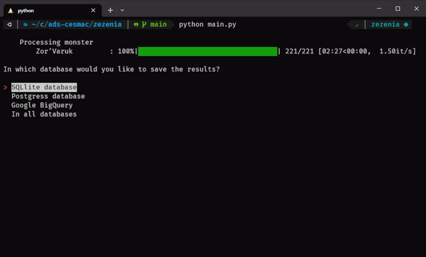
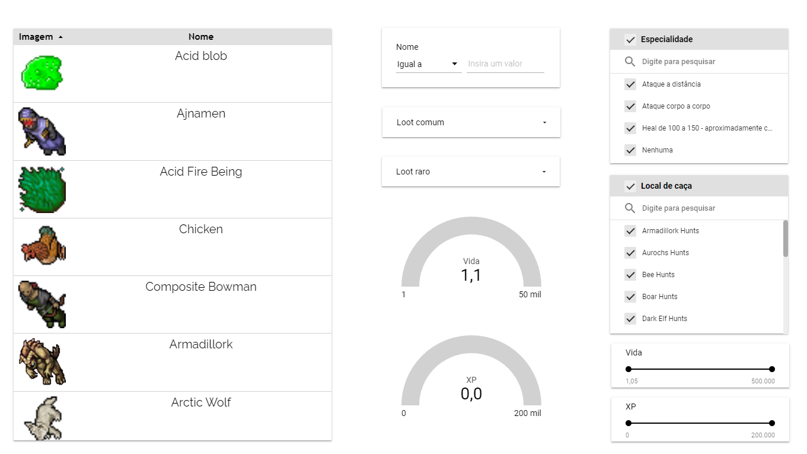

# **Monster Scraper**

This script scrapes monster data from https://zezeniabrasil.com/monsters/ using the monsters_scraper module and saves it to a database using the database module. This project was created for the modeling and data development discipline of the systems analysis course at CESMAC.

\


\
A dashboard was also created to view and analyze monster data. It can be accessed at the following link: https://lookerstudio.google.com/reporting/9a950d69-9f05-4724-ac6a-1874d91cce8a/page/f1IID

\


## **Usage**

\
To run the script, simply execute the following command in your terminal:

```
python main.py
```

\
You will be presented with a menu asking you to select the database you would like to save the data to. The options are:

- SQLite database
- Postgres database
- Google BigQuery
- All databases

\
Once you make your selection, the script will save the data to the selected database(s).

## **Requirements**

\
The following packages are required to run the script:

- simple_term_menu
- halo
- pandas
- sqlalchemy
- google-cloud-bigquery (if using Google BigQuery)

\
You can install these packages by running the following command:

```
pip install -r requirements.txt
```

License
This project is licensed under the MIT License - see the LICENSE file for details.
